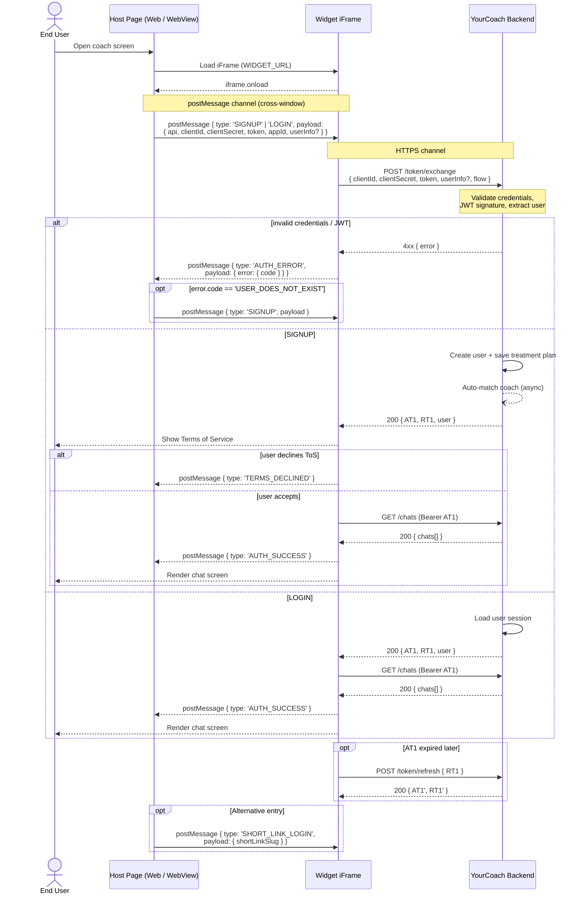

The diagram below illustrates the full request sequence from widget open through
YourCoach backend processing and chat display.

```mermaid
sequenceDiagram
    actor User as End User
    participant Host as Host Page (Web / WebView)
    participant Widget as Widget iFrame
    participant Backend as YourCoach Backend

    User->>Host: Open coach screen
    Host->>Widget: Load iFrame (WIDGET_URL)
    Widget-->>Host: iframe.onload

    Note over Host,Widget: postMessage channel (cross-window)

    Host->>Widget: postMessage { type: 'SIGNUP' | 'LOGIN', payload:<br/>{ api, clientId, clientSecret, token, appId, userInfo? } }

    Note over Widget,Backend: HTTPS channel

    Widget->>Backend: POST /token/exchange<br/>{ clientId, clientSecret, token, userInfo?, flow }
    Note over Backend: Validate credentials,<br/>JWT signature, extract user

    alt invalid credentials / JWT
        Backend-->>Widget: 4xx { error }
        Widget-->>Host: postMessage { type: 'AUTH_ERROR',<br/>payload: { error: { code } } }
        opt error.code == 'USER_DOES_NOT_EXIST'
            Host->>Widget: postMessage { type: 'SIGNUP', payload }
        end
    else SIGNUP
        Backend->>Backend: Create user + save treatment plan
        Backend--)Backend: Auto-match coach (async)
        Backend-->>Widget: 200 { AT1, RT1, user }
        Widget-->>User: Show Terms of Service
        alt user declines ToS
            Widget-->>Host: postMessage { type: 'TERMS_DECLINED' }
        else user accepts
            Widget->>Backend: GET /chats (Bearer AT1)
            Backend-->>Widget: 200 { chats[] }
            Widget-->>Host: postMessage { type: 'AUTH_SUCCESS' }
            Widget-->>User: Render chat screen
        end
    else LOGIN
        Backend->>Backend: Load user session
        Backend-->>Widget: 200 { AT1, RT1, user }
        Widget->>Backend: GET /chats (Bearer AT1)
        Backend-->>Widget: 200 { chats[] }
        Widget-->>Host: postMessage { type: 'AUTH_SUCCESS' }
        Widget-->>User: Render chat screen
    end

    opt AT1 expired later
        Widget->>Backend: POST /token/refresh { RT1 }
        Backend-->>Widget: 200 { AT1', RT1' }
    end

    opt Alternative entry
        Host->>Widget: postMessage { type: 'SHORT_LINK_LOGIN',<br/>payload: { shortLinkSlug } }
    end
```
